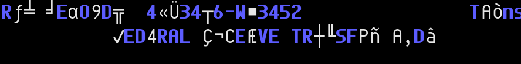

==============================
Terminal Eye Candies Directory
==============================

*They make your terminal look cool for screenshots!*

.. contents:: **Contents**
   :local:
   :backlinks: top

Categories
==========

* `Screensavers <Screensavers>`_

Uncategorized
=============

`No More Secrets`_: Hacking into Federal Reserve Like in Sneakers (1992)
------------------------------------------------------------------------

.. _No More Secrets: https://github.com/bartobri/no-more-secrets

``GPLv3 / C / [ncurses]``

* Original developer: Brian Barto in 2016
* Current maintainer: Brian Barto since 2016

More than twenty-five years ago, a group of sneakers -- a fugitive (Robert
Redford), an ex-CIA officer (Sidney Poitier), a conspiracist (Dan Aykroyd), a
young hacker (River Phoenix), and a blind phone phreak (David Strathairn) along
with the fugitive's ex-girlfriend (Mary McDonnell)-- was asked to recover a
"black box" by a NSA officer, which has the capability to hack into Federal
Reserve via dial-up networking.

No More Secrets ships with two programs, sneakers (security hacker) imitates
the computer screen we see decrypting in the scene and nms that display the
plaintext from standard input after the decrypting effect.  The author also
provides a C library LibNMS for the decrypting effect.

Copyright
=========

This list is published under the CC0, see LICENSE_.

.. _LICENSE: LICENSE
