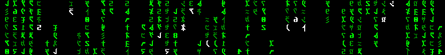
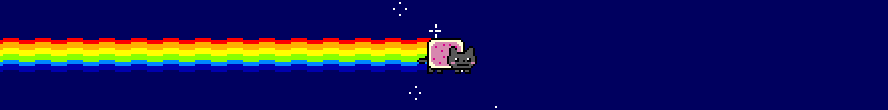
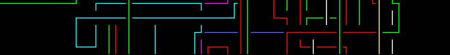

=====================
Terminal Screensavers
=====================

*They run pretty!*

.. contents:: **Screensavers**
   :local:

CMatrix_: Terminal based "The Matrix" like implementation 
=========================================================

.. _CMatrix: https://github.com/abishekvashok/cmatrix

   (run in xterm with mtx.pcf)

``GPLv3 / C / ncurses / virtual console / xterm / Linux / Mac``

* Original developer: Chris Allegretta in 1999
* Current maintainer: Abishek V Ashok since 2017

After the first The Matrix film release in 1999, the resistance is not only on
the silver screen, but also in the reality, the original developer spent one
evening to bring the green rain to real computer world, that has ever since
assimilated many terminals.

The iconic Matrix digital rain may reveal secret inside your terminal, you may
not able to decrypt the Matrix code nor to manipulate simulated reality, but
you can control the rain with at least a dozen of options, scrolling styles,
text attributes, fonts with actual Matrix-looking glyphs for virtual console
and xterm, you can even make it rainbow!

Nyancat_: terminal-based Pop Tart Cat animation
===============================================

.. _Nyancat: https://github.com/klange/nyancat

``NCSA / C / ANSI / telnet / Linux / *BSD``

* Original developer: Kevin Lange in 2011
* Current maintainer: Kevin Lange since 2011

In 2011, Pop-Tarts and a cat had an unusual union (by Christopher Torres),
together with the cover song Nyanyanyanyanyanyanya! by Momone Momo, a new breed
of digital feline was conceived on YouTube, it's called "Nyan Cat," and it has
since been running in kittigilion-load of computers till today, and still
nyaning through the galaxy.

And there was Nyancat, one of the first ones to computerize Nyan Cat for
terminal fanatics' enjoyments, teleporting Nyan Cat and trailing bright colors
to their terminals,  it may not have many customizations, but it enables you
with a simple telnet command to its server for endless nyan fix.  Nyancat isn't
alone, unicorn and little ponies soon to follow.

pipes.sh_: Animated pipes terminal screensaver
==============================================

.. _pipes.sh: https://github.com/pipeseroni/pipes.sh

``MIT / Bash 4+ / Linux / Mac``

* Original developer: Matthew Simpson in 2010
* Current maintainer: Pipeseroni since 2015

A script was originally published on Arch Linux Forums (see @pipeseroni's
website), and then it started to crawl on many computers, to appear in every
show-off desktop screenshots.  People would ask "What's that colorful lines
thingy?"  "Pipes," the answer they would get and the script would be piped into
their home directory, wherever they hoard interesting scripts.

It was only years ago, and the pipes and all its descendants, forks, and
re-implementations still pipe strong.  The inspiration was Windows' pipes
screensaver, now it screen-saves terminals with colors and crawling pipes of
amazing 10 types of pipes, from ASCII to Unicode box-drawing characters to
railway to something called knobby.
